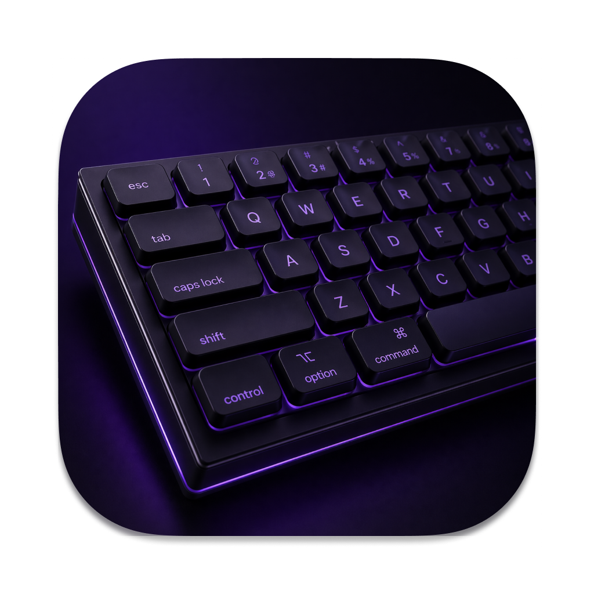

# Swit-her — Переключатель раскладки для macOS

**Swit-her** — это утилита для быстрого исправления текста, набранного в неправильной раскладке клавиатуры. Аналогично работе Punto Switcher, но без установки каких-то браузеров и всякого подобного.

### Основные возможности:

1. **Исправление выделенного текста**
   - Выдели текст, набранный в неправильной раскладке
   - Нажми клавишу переключения (по умолчанию **Option**)
   - Текст автоматически конвертируется и раскладка переключается

2. **Переключение раскладки**
   - Если текст не выделен,  переключает раскладку клавиатуры у последнего слова 

3. **Выбор клавиши переключения**
   - **Option (Alt)** — по умолчанию
   - **Ctrl** — альтернативный вариант
   - Настраивается через меню в строке меню

### Примеры использования:

**Пример 1: Исправление текста**
```
Набрал: ghbdtn vbh (английская раскладка)
Выделил → нажал Option или Ctrl
Результат: привет мир (русская раскладка)
```

**Пример 2: Обратное исправление**
```
Набрал: руддщ цщкдв (русская раскладка)
Выделил → нажал Option
Результат: hello world (английская раскладка)
```


### Отличия от Punto Switcher:

**Swit-her** — это упрощённая версия, которая исправляет текст **по требованию** (когда ты нажимаешь клавишу), а не автоматически при вводе.

## Установка

### Системные требования
- macOS 11.0 (Big Sur) или новее
- Разрешение Accessibility (настраивается при первом запуске)

### Шаги установки

1. Скачай и открой `Swit-her.dmg`
2. Дважды кликни на **Swit-her.pkg**
3. Если macOS блокирует установку, то зайди в Настройки, Конфиденциальность и безопасность, прокрути страницу вниз и там разреши открыть приложение Swit-her
4. Следуй инструкциям установщика
5. Готово!

## Настройка

### Первый запуск

1. Запусти **Swit-her** из папки Applications
2. Если появится диалог "Swit-her — нет доступа":
   - Открой **Системные настройки** → **Конфиденциальность и безопасность** → **Универсальный доступ**
   - Нажми **+** и выбери `Swit-her` из папки Applications
   - Убедись, что галочка установлена
3. Перезапусти **Swit-her**
4. В строке меню появится иконка **⊷**

### Настройка клавиши переключения

1. Кликни на иконку **⊷** в строке меню
2. Выбери **Клавиша переключения:**
   - **Alt (Option)** — по умолчанию
   - **Ctrl** — альтернативный вариант
3. Настройка сохраняется автоматически


## Сборка из исходников

```bash
git clone https://github.com/yourusername/swit-her.git
cd swit-her
./build.sh
```

Результат: `dist/Swit-her.dmg` (содержит `Swit-her.pkg`)

### Требования для сборки
- macOS 11.0 или новее
- Python 3.11 или новее
- Xcode Command Line Tools

## Устранение проблем

### "Приложение не переключает раскладку"

**Причина:** Не выдано разрешение Accessibility

**Решение:**
1. Открой **Системные настройки** → **Конфиденциальность и безопасность** → **Универсальный доступ**
2. Найди `Swit-her` в списке
3. Убедись, что галочка установлена
4. Если приложения нет в списке, нажми **+** и добавь его
5. Перезапусти приложение

### "Текст не исправляется"

**Причина:** Текст не выделен или приложение не поддерживает выделение

**Решение:**
1. Убедись, что текст выделен (подсвечен)
2. Попробуй выделить текст другим способом (Shift + стрелки вместо мыши)
3. Некоторые приложения (например, терминалы) могут не поддерживать автоматическое исправление

### "PKG не устанавливается"

**Причина:** macOS блокирует установку из неподписанных источников

**Решение:**
1. Кликни **ПКМ** на `Swit-her.pkg` → **Открыть**
2. Подтверди открытие в диалоге
3. Следуй инструкциям установщика

### Ручная установка (если PKG не работает)

```bash
# Распакуй PKG
pkgutil --expand Swit-her.pkg ~/Desktop/swit-her-extracted
cd ~/Desktop/swit-her-extracted

# Извлеки приложение
tar -xzf Payload -C /Applications

# Сними карантин
xattr -rd com.apple.quarantine /Applications/Swit-her.app
```

## Поддерживаемые раскладки

- **Русская** (Russian)
- **Английская** (US, ABC, British, Australian)

Другие раскладки могут работать некорректно.

## Технические детали

- **Язык:** Python 3.11
- **Фреймворки:** rumps, PyObjC (AppKit, Quartz, CoreFoundation)
- **Метод:** Event Tap (требует Accessibility)
- **Алгоритм:** Определение раскладки по символам → конвертация → вставка


## Благодарности

Спасибо [Polza.ai](https://polza.ai/?referral=7JCOejzeO6). У них модели дешевле чем на Openrouter. 
Это приложение было сделано с помощью Claude Sonnet через OpenCode.

